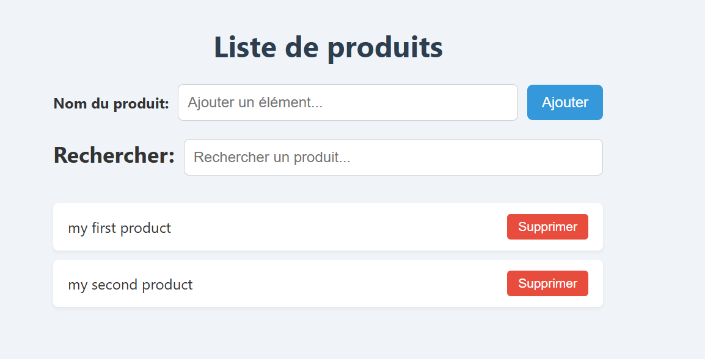

Gestionnaire de produits: crud simple:

Ce projet est une petite application web permettant d'ajouter et d'afficher des produits, avec sauvegarde locale grâce à `localStorage`. Il s'agit d'un exemple basique de CRUD (Create, Read) en HTML, CSS et JavaScript. 

---

## Fonctionnalités:

- Ajouter un produit
- Afficher les produits sous forme de liste
- Sauvegarde automatique dans `localStorage`
- Interface simple et responsive
- Avec la fonctionalité de suppression avec actualisation automatique 
- Et enfin la recherche 

---

## Technologies utilisées

- HTML5
- CSS3 (style simple et moderne)
- JavaScript Vanilla (sans framework)
- LocalStorage pour la persistance des données

---

## Utilisation

1. Voir l'avancement du projet sur: 

   https://github.com/boubakerjouini/stage2025

2. Cloner le dépôt ou télécharger le code ( Télécharger le projet complet, mais version développeur):

git clone https://github.com/yasmine-sbh/product-list-js

crud-produit-simple:

├── index.html        # Page principale
├── style.css         # Style de l'interface
└── script.js         # Logique JavaScript (CRUD + localStorage)

3. Lien vers demo en ligne

https://yasmine-sbh.github.io/product-list-js/

4. Un apperçu capture d'écran

## Aperçu de l'application

5. Tout est enregistré dans la branche suivante avec un push dans crud-product:

git push origin crud-product 